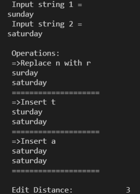

<h1 align="center">
Final Machine Project in CSADPRG 

(Advanced Programming and 
Theory of Programming Languages)

</h1>

📝**About**:
   - Finds the minimum edit distance given two input strings. 
    
   - The two strings need not be of the same lengths and the operations involving single-character edits include 
        deletion, insertion, and substitution; all of which had equal costs which is one, based on the machine project’s specifications. 
    
   - A dynamic programming approach was used to compute for the minimum edit distance. 
    
   - Aside from having the minimum edit distance as output, the Software Application also included the feature of printing out the 
        specific operations used as the minimum edit distance was being computed and it also prints the strings as the different 
        operations were being applied. 

💻**To run**:

   - Install GNU Fortran compiler, compile, then run (linux-based OS dependent).
